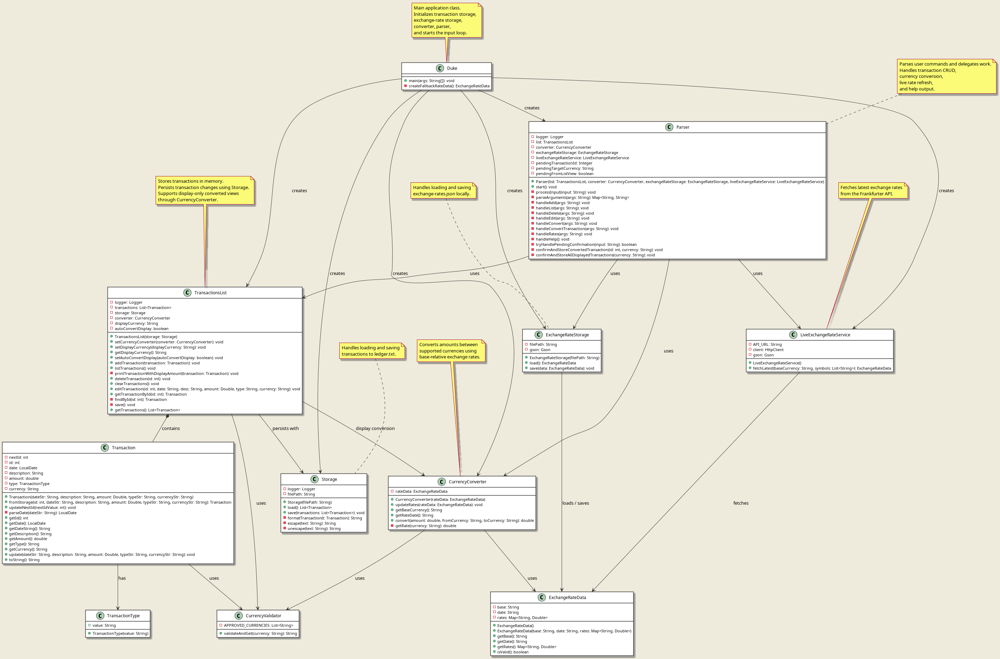

# Developer Guide

## Acknowledgements

This project is built on the Java platform and follows object-oriented design principles. The application structure is inspired by the individual project iP.

**Note**: The PlantUML diagram source files are located in the `docs/diagrams/` directory. To generate PNG images from the `.puml` files, use a PlantUML tool or online generator.

## Additional Notes
For JJ: modify the architecture below to add conversion

For JJ and Chingy: add your parts (proposed and implemented)

## Design & Implementation

### Architecture

The following architecture diagram provides a high-level view of the Transaction Manager system:

The Transaction Manager follows a layered architecture with the following main components:

1. **Main**: The entry point that initializes all components and starts the application loop.
2. **Parser**: Handles user input parsing, command validation, and delegates operations to the TransactionsList.
3. **TransactionsList**: Manages the collection of Transaction objects and provides CRUD operations.
4. **Transaction**: Represents individual financial transactions with validation and data integrity.
5. **Validators**: Utility classes (CurrencyValidator, TransactionType) that enforce business rules.

The components interact as follows:
- `Duke` creates and initializes `Parser` and `TransactionsList`.
- `Parser` processes user commands and calls methods on `TransactionsList`.
- `TransactionsList` manages `Transaction` objects and uses validators for data integrity.
- `Transaction` objects encapsulate individual transaction data and validation logic.

### Design Considerations

**Transaction Storage**: Transactions are stored in an ArrayList for efficient random access and iteration. This design choice supports the application's requirement for fast listing and editing operations.

**Command Parsing**: The Parser uses simple string splitting and HashMap storage for command arguments, providing flexibility for future command extensions without complex parsing logic.

**Validation Separation**: Validation logic is separated into dedicated classes (CurrencyValidator, TransactionType) to follow the Single Responsibility Principle and enable easy testing and modification.

### Component-Level Design

#### Parser Component
The Parser component is responsible for:
- Reading user input from the console
- Parsing command strings into actionable operations
- Validating command syntax and arguments
- Delegating operations to the TransactionsList component
- Providing user feedback and error messages

#### Transaction Management Component
The TransactionsList component provides:
- Storage and management of Transaction objects using ArrayList
- Auto-incremented ID generation
- CRUD operations (add, list, edit, delete, clear)
- Data integrity maintenance
- Logging for debugging and monitoring

#### Model Components
The Transaction, TransactionType, and CurrencyValidator classes form the data model:
- **Transaction**: Represents a financial transaction with date, description, amount, type, and currency
- **TransactionType**: Validates and stores transaction type (debit/credit)
- **CurrencyValidator**: Validates currency codes against an approved list

### Class Diagrams

The following class diagram shows the relationships between all components:

**Key Relationships**:
- `Duke` aggregates `Parser` and `TransactionsList`
- `Parser` uses `TransactionsList` for operations
- `TransactionsList` contains multiple `Transaction` objects
- `Transaction` uses `TransactionType` and `CurrencyValidator`
- All components use Java's built-in collections and utilities

## Implementation Details

### Transaction Flow

CRUD
Storage
Transaction Data Model

Design Decisions

Alternatives Considered

### Currency Conversion Feature
Implementer: JJ

### [Proposed] Improved Account Validation and Hierarchical Account Registry
Implementer: Pran

### [Proposed] Date and Regex Filtering Enginer
Implementer: ??

### [Proposed] Transaction Presets and UI Improvements
Implementer: ??

## Appendix: Requirements

### Target User Profile

The Transaction Manager is designed for:

- **Individuals** who need to track personal financial transactions
- **Small business owners** who require simple expense tracking
- **Students** learning about financial management
- **Users comfortable with command-line interfaces**
- **Those who prefer typing over mouse interactions**

### Value Proposition

The Transaction Manager solves several key problems:

1. **Simplified Financial Tracking**: Provides a straightforward way to record and manage financial transactions without complex accounting software.
2. **Rapid Data Entry**: Command-line interface allows for faster transaction entry compared to GUI applications for users comfortable with typing.
3. **Portability**: Lightweight Java application that runs on any platform with Java 17+ installed.

### User Stories

| Version | As a ... | I want to ...                              | So that I can ...                                                 |
| ------- | -------- | ------------------------------------------ | ----------------------------------------------------------------- |
| v1.0    | new user | see usage instructions                     | refer to them when I forget how to use the application            |
| v1.0    | user     | add a new transaction                      | record my financial activities                                    |
| v1.0    | user     | list all transactions                      | view my transaction history                                       |
| v1.0    | user     | edit a transaction                         | correct mistakes in previously recorded transactions              |
| v1.0    | user     | delete a transaction                       | remove erroneous or duplicate entries                             |
| v1.0    | user     | clear all transactions                     | start fresh with a clean transaction list                         |
| v2.0    | user     | filter transactions by date                | review transactions from specific time periods                    |
| v2.0    | user     | search transactions by description         | find specific transactions quickly                                |
| v2.0    | user     | validate my transactions                   | ensure my double-entry accounts are balanced                      |
| v2.0    | user     | add new categories under each account type | filter by transaction easily and see where I am spending my money |
| v2.0    | user     | be able to categorise transactions         | filter by transaction type                                        |
| v2.0    | user     | generate balance sheet report              | get a detailed look into my assets                                |

### Non-Functional Requirements

1. **Reliability**
   - Application should not crash on invalid user input
   - Data should remain consistent during CRUD operations
   - Error messages should be helpful and actionable

2. **Usability**
   - Command syntax should be intuitive and consistent
   - Help text should be accessible via a help command
   - Error messages should clearly indicate what went wrong and how to fix it

3. **Maintainability**
   - Code should follow Java coding standards
   - Comprehensive unit tests should cover critical functionality
   - Code should be well-documented with JavaDoc comments
   - Separation of concerns should be maintained between components

## Glossary

* **Transaction**: A financial record containing date, description, amount, type (debit/credit), and currency.
* **Debit**: A transaction representing money leaving an account (expense, payment).
* **Credit**: A transaction representing money entering an account (income, deposit).
* **Currency Code**: Three-letter ISO currency code (SGD, USD, EUR).
* **Parser**: Component responsible for interpreting user commands and delegating to appropriate handlers.
* **TransactionsList**: Repository managing the collection of Transaction objects.
* **Validation**: Process of ensuring data meets predefined rules before processing.
* **Auto-increment ID**: Automatically generated unique identifier for each transaction.
* **CRUD Operations**: Create, Read, Update, Delete - the four basic operations of persistent storage.
